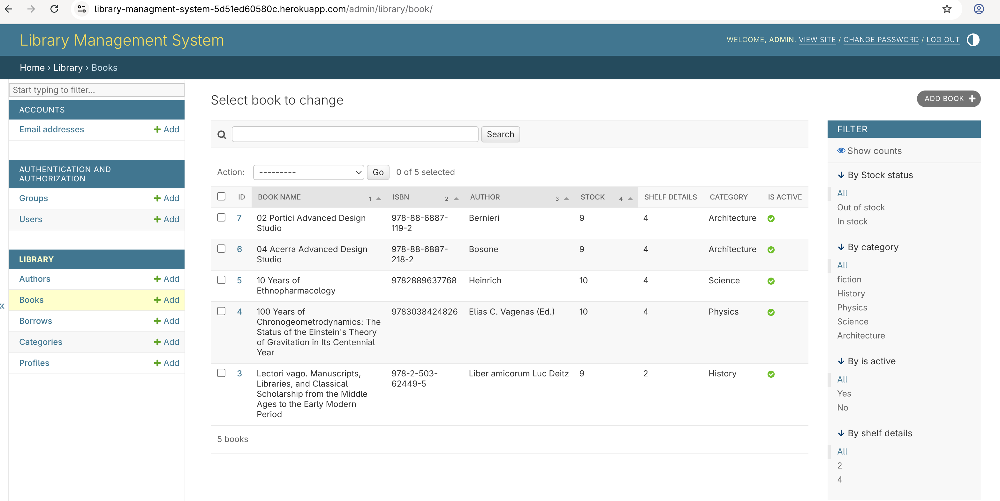
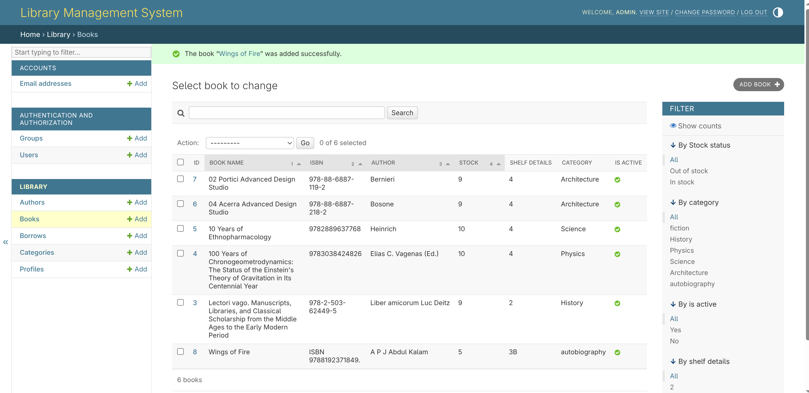
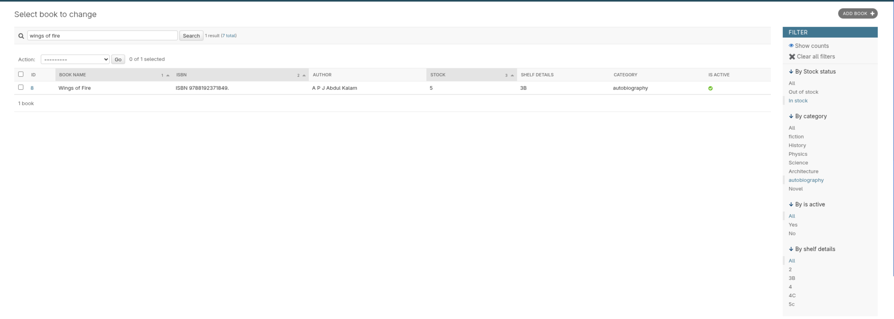
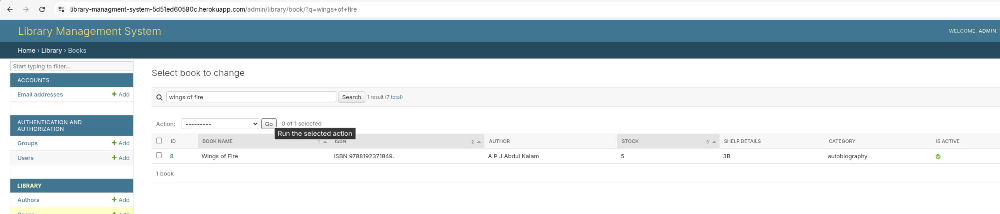
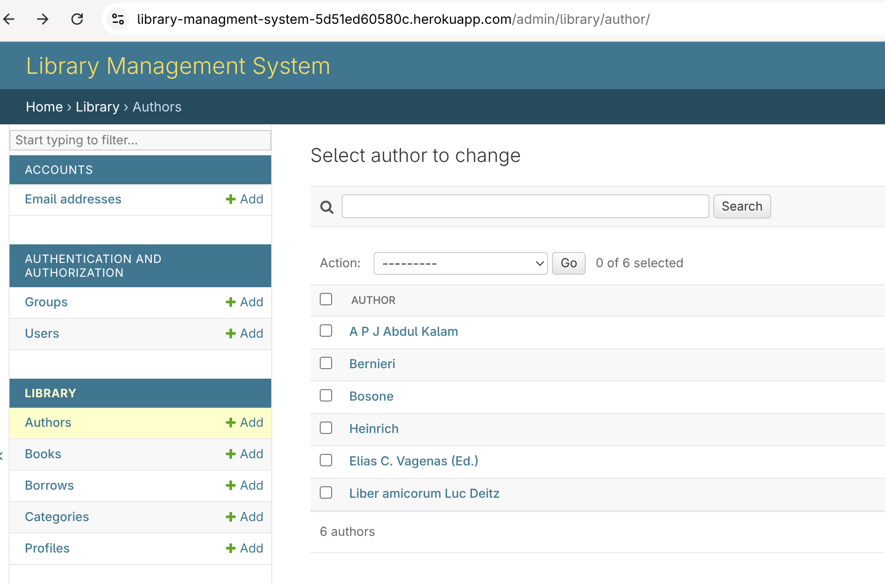
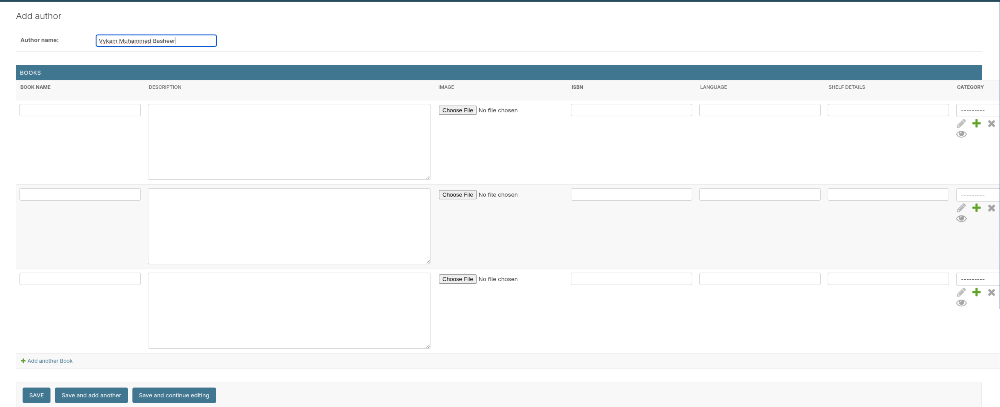
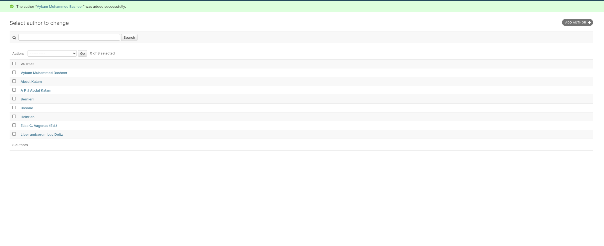
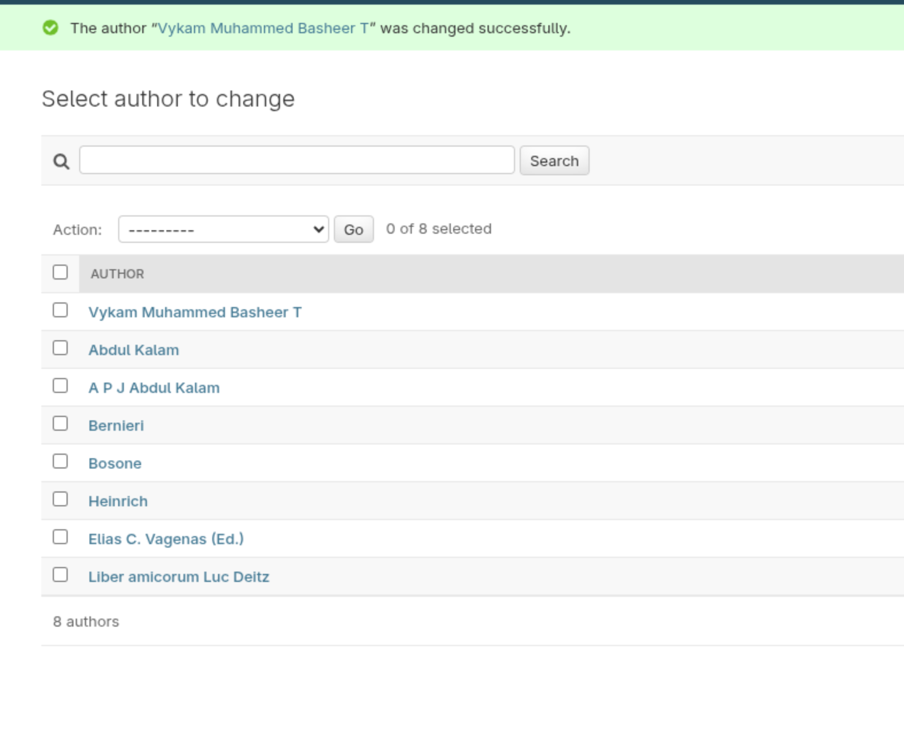
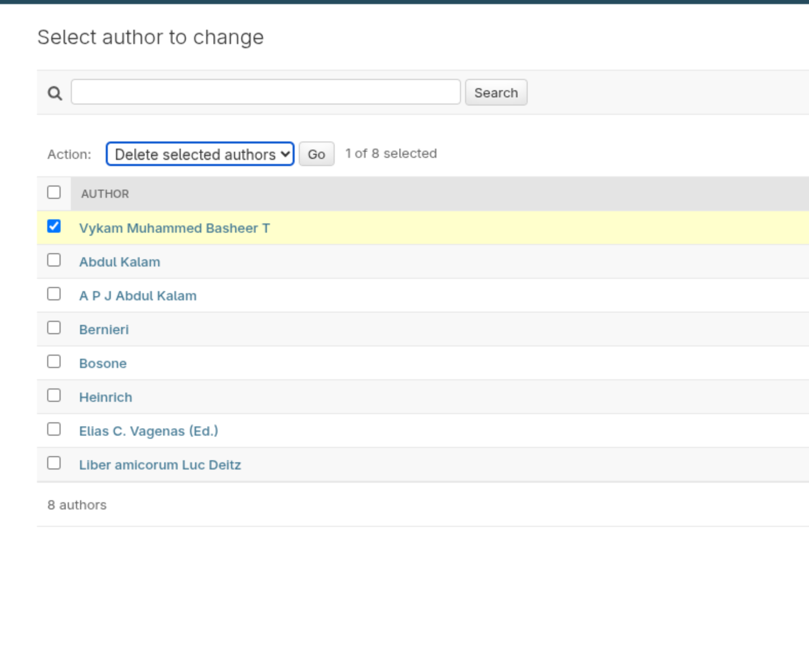
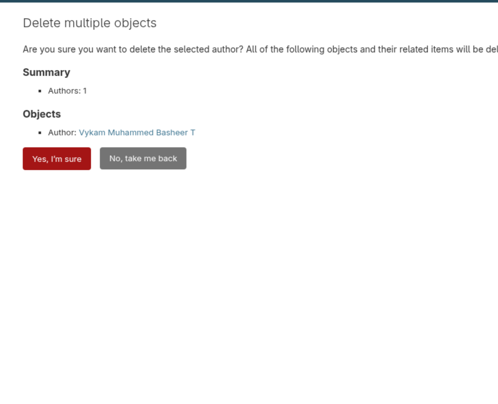

# Library Management System

A web-based Library Management System built with Django designed to streamline and automate the core operations of a library. The system provides an efficient way to manage books, authors, categories, and users, while handling key circulation processes such as issuing, returning, and renewing books.
It supports both admin/staff users and regular users, each with clearly defined roles and responsibilities. Admins and staff have full control over the system, including managing the book catalog, organizing authors and categories, handling user accounts, and processing book transactions. Regular users can browse the catalog, view detailed book information, borrow available books, request renewals, and track their borrowing history.
The application implements role-based access control, ensuring that only authorized staff members can perform specific operations like issuing or returning books. This enhances both security and operational reliability.
Additionally, the system features a responsive user interface built with Bootstrap, providing a clean and user-friendly experience across different devices. With support for pagination, search, and filtering (by ISBN, title, and author), the platform is designed to handle larger datasets efficiently and improve usability.
The system also integrates Cloudinary for efficient cloud-based media storage and delivery.
Overall, the system aims to reduce manual workload, improve record accuracy, and provide a structured, scalable solution for modern library management.

## Features

### Admin and Staff Features

### Add, Update, and Delete Books

Admins or staff can manage the library catalog by adding new books, editing existing book details (such as title, author, ISBN, and available copies), and removing books that are no longer in circulation. This ensures the catalog remains accurate and up to date.

### Filter and Search Books

Admins can quickly locate books using filtering and search functionality based on ISBN, title (name), or author. This makes it efficient to manage large collections and perform updates without manually browsing through all records.

### Manage Book Authors

Staff can create, update, and delete author records. This ensures proper organization of books and prevents duplication of author information.

### Manage Book Categories

Admins can define and manage book categories (e.g., Fiction, Science, Technology), improving organization and making it easier for users to browse books.

### Manage Users

Staff can view and manage registered users, including creating new accounts, updating user information, and handling user access. This helps maintain control over who can borrow books and use the system.

### Issue Books to Users

Staff are responsible for issuing books to users. When a book is issued, the system records the issue date and calculates a due date, while also updating the number of available copies.

### Approve and Handle Returns & Renewals

Staff oversee the return and renewal process. They can confirm when a book is returned (updating availability) and approve renewal requests, extending the borrowing period when applicable.

## User Features

### Browse Available Books

Users can explore the library catalog with a paginated listing of books, making it easy to navigate through large collections efficiently.

### View Book Details

Each book has a detailed view displaying key information such as title, author, ISBN, availability status, and cover image, helping users make informed borrowing decisions.

### Borrow Books

Users can request to borrow available books. Once approved or processed by staff, the book is issued and linked to the user’s account with a defined due date.

### Renew Borrowed Books

Users have the option to request a renewal for borrowed books before the due date, allowing them to extend the borrowing period (subject to staff approval or system rules).

### Return Books

Users can return borrowed books through the system. Once processed, the book becomes available again for others.

### Track Borrowing History

Users can view their borrowing history, including issued books, due dates, returned items, and current borrowing status. This provides transparency and helps users manage deadlines effectively.

## Tech Stack

    • Backend: Django (Python),Pycharm
    • Frontend: HTML, CSS, Bootstrap 
    • Database: PostgreSQL(dbeaver) 
    • Authentication: Django’s built-in authentication system

### Architecture (Django MVT Pattern)

The application is built using Django’s MVT (Model–View–Template) architectural pattern, which is conceptually similar to the traditional MVC pattern.

### MVC vs Django (MVT Mapping)

MVC Component	Django Equivalent	Description
Model	Model	Handles database structure and data logic
View	Template	Responsible for UI and presentation layer
Controller	View	Contains business logic and request handling

## Components Overview

###  Model (Data Layer)

Defines the structure of the database using Django ORM.
Examples in this project:
    • Book 
    • Author 
    • Category 
    • BorrowRecord 
The model handles:
    • Data validation 
    • Relationships (e.g., book–author, book–category) 
    • Database queries 

### View (Business Logic Layer)

Django views act like controllers in MVC. They:
    • Process incoming HTTP requests 
    • Interact with models 
    • Apply business logic (issue, return, renew books) 
    • Return responses (HTML pages or redirects) 

###  Template (Presentation Layer)

Templates define how data is displayed to users using HTML and Django Template Language (DTL).
They:
    • Render dynamic content 
    • Display book listings, forms, and user data 
    • Use Bootstrap for responsive UI 

### Request Flow

    1. User sends a request (e.g., view books) 
    2. URL routes the request to a Django view 
    3. View processes logic and interacts with models 
    4. Data is passed to a template 
    5. Template renders the final HTML response

## Database

The application uses PostgreSQL as the primary database in production, providing better performance, scalability, and reliability compared to SQLite.

### Development vs Production

    • Development: SQLite (default Django database for simplicity) 
    • Production: PostgreSQL (via Heroku Postgres) 

### Configuration

Database configuration is handled using dj-database-url, which allows seamless switching between environments using the DATABASE_URL environment variable provided by Heroku.
Example configuration in settings.py:

**import dj_database_url**

**import os

DATABASES = {
    'default': dj_database_url.config(
        default=os.getenv('DATABASE_URL')
    )
}**
## Authentication
The application uses Django’s built-in authentication system to handle user registration, login, and access control.
It provides:

    • User Registration & Login: Secure authentication for users and staff 
    • Password Management: Password hashing and validation handled by Django 
    • Session Management: Maintains user sessions after login 
    • Role-Based Access: Differentiates between admin/staff and regular users 
    • Permission System: Restricts actions such as issuing, returning, and renewing books to authorized staff only
## Media File Handling (Cloudinary)
The application uses Cloudinary for managing and serving uploaded media files such as book cover images.
 
 **Configuration**

Cloudinary is integrated into the Django project using environment variables for secure configuration:

    • CLOUDINARY_CLOUD_NAME 
    • CLOUDINARY_API_KEY 
    • CLOUDINARY_API_SECRET 
These credentials are stored in Heroku Config Vars and not exposed in the codebase.

## Future Improvements
    • Email notifications for due dates 
    • Fine calculation for late returns 
    • REST API (Django REST Framework) 
    • Advanced search and filtering 
    • Docker deployment

## Development Methodology (Agile)
This project was developed using an Agile methodology, focusing on iterative development, continuous improvement, and incremental feature delivery.

### Iterative Development
The system was built in multiple small iterations, where each phase introduced a specific set of features. This allowed continuous testing and refinement throughout development.
### User Stories
Features were planned and implemented using user stories to define requirements clearly. Examples:

    • As a user, I can browse available books so that I can choose what to borrow 
    • As an admin, I can manage books so that the catalog stays updated 
    • As staff, I can issue and return books so that circulation is properly tracked

## Installation
### 1. Clone the Repository:- 
    git clone https://github.com/your-username/library-management.git
    cd library-management
### 2. Create Virtual Environment
    python -m venv venv
    source venv/bin/activate   
    # On Windows: venv\Scripts\activate
### 3. Install Dependencies
    pip install -r requirements.txt
### 4. Apply Migrations
    python manage.py migrate
### 5. Create Superuser
    python manage.py createsuperuser
### 6. Run the Server
    python manage.py runserver
    Visit: http://127.0.0.1:8000/

## Automated Testing (tests.py)
    Unit tests and basic integration tests have been written to validate core functionalities, including:
    • Book creation, update, and deletion 
    • Author and category management 
    • User-related operations 
    • Book issue, return, and renewal workflows 
    • Validation of business rules (e.g., book availability) 
### Permission Testing
    Tests verify that role-based permissions are enforced correctly:
    • Only staff users can issue, return, or renew books 
    • Regular users are restricted from admin-level actions 
### Workflow Testing
    Key system workflows are tested to ensure proper behavior:
    • Issuing a book updates availability and creates a record 
    • Returning a book updates status and restores availability 
    • Renewing a book correctly extends the due date 
### Running Tests
    To execute the test suite, run:
     python manage.py test
    This will automatically discover and run all test cases defined in tests.py.
### Manual Testing
In addition to automated tests, manual testing was performed to validate:

• User interface behavior 

• Form handling and validations 

• End-to-end user interactions

## Validators testing
**w3c

css

python

docstring

light house report**

## References

- [Django Official Website](https://www.djangoproject.com)  
  Core framework documentation and resources.

- [Customize Django Admin](https://testdriven.io/blog/customize-django-admin/#custom-admin-actions)  
  How to extend and customize admin functionality.

- [django-widget-tweaks](https://github.com/jazzband/django-widget-tweaks)  
  Template-level form customization library.

- [Reusable Form Templates](https://docs.djangoproject.com/en/5.2/topics/forms/#reusable-form-templates)  
  Best practices for reusable Django forms.

- [Custom Authentication](https://docs.djangoproject.com/en/6.0/topics/auth/customizing)  
  Customizing Django authentication system.

- [DOAB Books Directory](https://directory.doabooks.org)  
  Open-access book dataset used in this project.